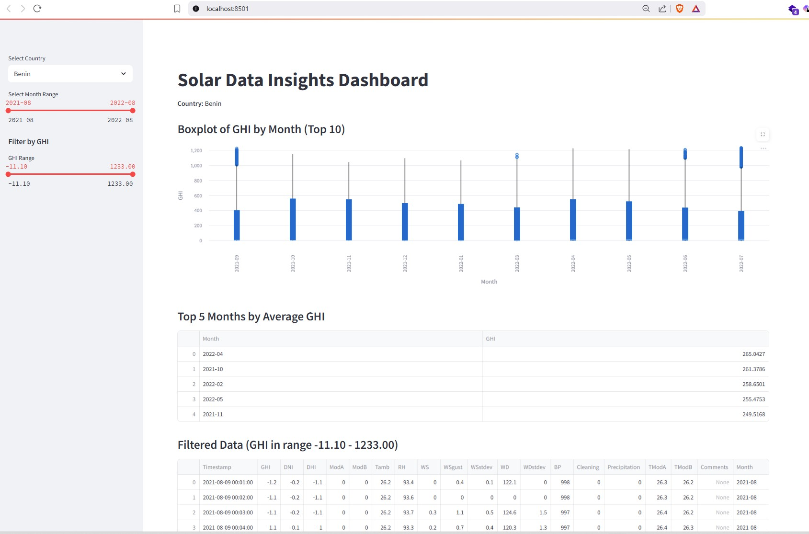
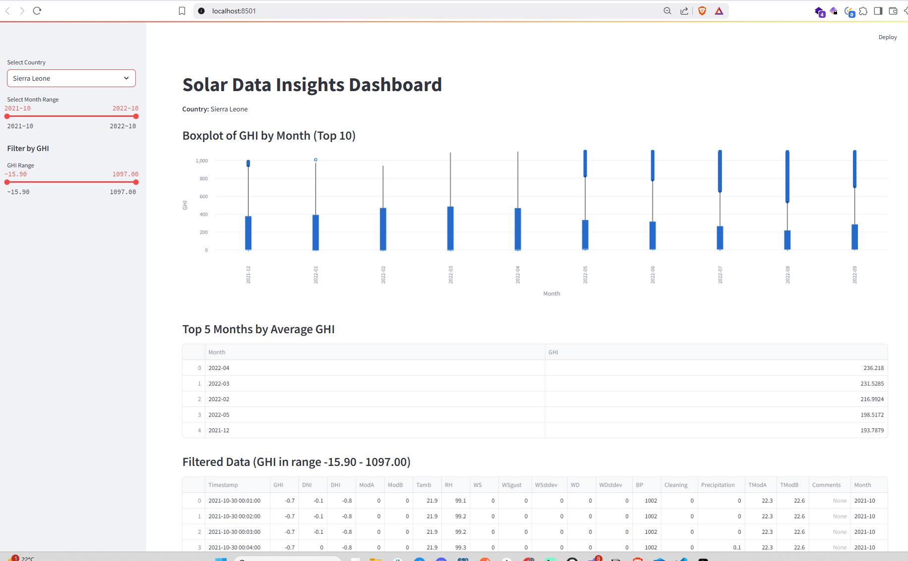
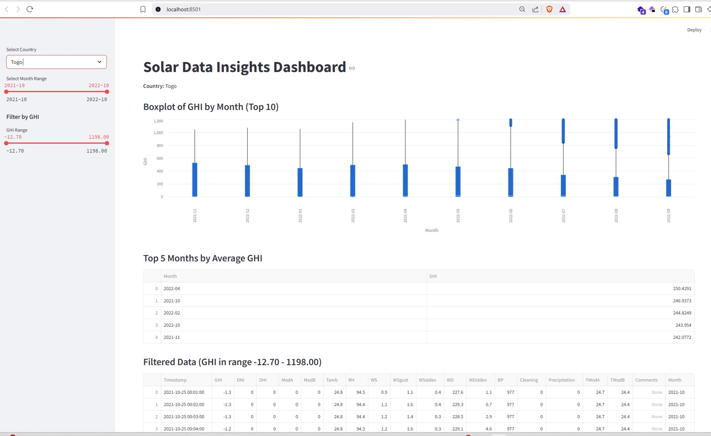

# Solar Challenge Week 1 - Solar Data Discovery
As part of 10 Academy training, This is a challenge project which is focused on understanding, exploring, and analyzing solar farm data found in Benin, Sierra Leone, and Togo. 

### Business Objective
MoonLight Energy Solutions aims to develop a strategic approach to significantly enhance its operational efficiency and sustainability through targeted solar investments. As an Analytics Engineer at MoonLight Energy Solutions, your task is to perform a quick analysis of an environmental measurement provided by the engineering team and translate your observation as a strategy report. Your analysis should focus on identifying key trends and learn valuable insights that will support your data-driven case - your recommendation based on the statistical analysis and EDA.  In particular, your analysis and recommendation must present a strategy focusing on identifying high-potential regions for solar installation that align with the company's long-term sustainability goals. Your report should provide an insight to help realize the overarching objectives of MoonLight Energy Solutions.

### Datashet Overview
The data is extracted and aggregated from [Solar Radiation Measurement Data](https://energydata.info/dataset/?q=Solar+Radiation+Measurement&vocab_regions=AFR). Each row in the data contains the values for solar radiation, air temperature, relative humidity, barometric pressure, precipitation, wind speed, and wind direction, cleaned and soiled radiance sensor (soiling measurement) and cleaning events.

## Project Structure

```
solar-challenge-week1/
├── app/
│   ├── __init__.py
│   ├── main.py         # main Streamlit application script
│   ├── utils.py        # utility functions for data processing and visualization
│   └── __pycache__/
├── data/
│   ├── benin_clean.csv
│   ├── sierraleone_clean.csv
│   ├── togo_clean.csv
│   └── ...             # raw and other data files
├── dashboard_screenshots/
│   ├── dashboard_benin.jpg
│   ├── dashboard_serraleone.jpg
│   └── dashboard_togo.jpg
├── notebooks/
│   ├── benin_eda.ipynb
│   ├── sierraleone_eda.ipynb
│   ├── togo_eda.ipynb
│   ├── compare_countries.ipynb
│   └── README.md
├── scripts/
│   └── __init__.py
├── tests/
│   └── __init__.py
├── requirements.txt
└── README.md
```

## Setup
1. Clone: `git clone https://github.com/Melak12/solar-challenge-week1.git`
2. Create venv: `python3 -m venv .venv`
3. Activate: `source .venv/bin/activate` (macOS/Linux) or `.venv\Scripts\activate` (Windows)
4. Install: `pip install -r requirements.txt`

## Streamlit Dashboard

This project includes an interactive dashboard for visualizing solar data insights using Streamlit.

### Development Process
- The dashboard is implemented in `app/main.py` using Streamlit and Altair for interactive visualizations.
- Utility functions for data loading and processing are in `app/utils.py`.
- Data files are located in the `data/` directory.
- The dashboard allows users to select a country, view boxplots of GHI by region, see the top regions by average GHI, and filter data interactively.

### Usage Instructions

1. **Activate the virtual environment:**
   ```cmd
   .venv\Scripts\activate
   ```
2. **Install dependencies:**
   ```cmd
   pip install -r requirements.txt
   ```
3. **Run the Streamlit app:**
   ```cmd
   cd app
   streamlit run main.py
   ```
4. **Open the dashboard:**
   - The app will open in your default browser. If not, visit the URL shown in the terminal (usually http://localhost:8501).

### Features
- Country selection sidebar
- Boxplot of GHI by region (top 10 regions)
- Table of top 5 regions by average GHI
- Interactive slider to filter data by GHI range

## Dashboard Screenshots

Below are example screenshots of the Streamlit dashboard for each country:

**Benin**



**Sierra Leone**



**Togo**



